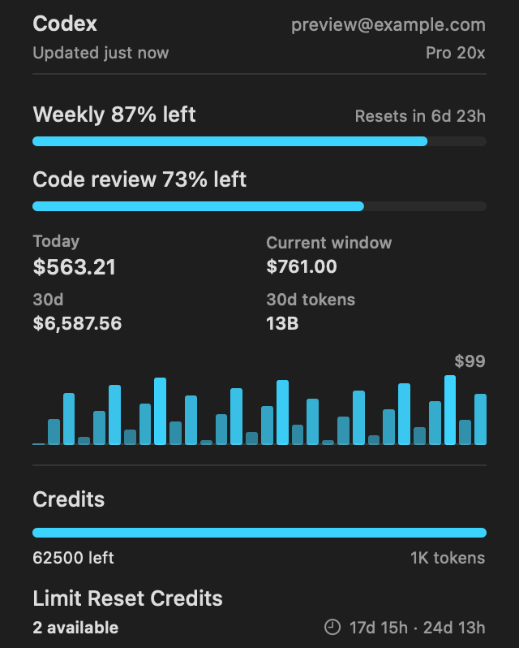
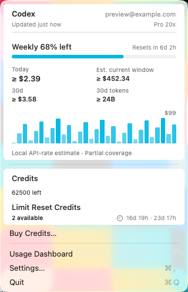

# Keep the CodexBar fork current

Keep the customized app on `dr-baker/CodexBar`'s `main` branch. Use the upstream sync PR to review updates from `steipete/CodexBar` before installing them locally.

## Read the customized menu

Local Codex dollar amounts estimate usage at API rates. They do not represent your subscription bill. A `≥` prefix means the displayed amount is a known subtotal: some prices, usage records, or history are still missing. Missing prices alone do not make measured token counts incomplete.

Purchased credits show the reported balance. A progress bar appears only when the provider supplies a monthly limit.

The fork includes the pricing-recovery and duplicate-record repairs from upstream PRs [#4270](https://github.com/steipete/CodexBar/pull/4270) and [#4290](https://github.com/steipete/CodexBar/pull/4290). Existing history reparses in bounded passes; partial totals remain labeled while that runs. Saved unknown-price markers stay unknown because the cache cannot distinguish lost pricing from intentionally invalidated evidence. Rebuilding the derived cost cache from session logs can recover those amounts; `codexbar cache clear --cost` clears cost caches for every provider.

These native menu screenshots use synthetic data over a busy background to check contrast and coverage labels:




## Enable daily sync PRs

1. Land `.github/workflows/fork-sync.yml` on the fork's `main` branch. The daily schedule starts after this change lands.
2. Enable Actions in the fork. In [Actions settings](https://github.com/dr-baker/CodexBar/settings/actions), select **Allow GitHub Actions to create and approve pull requests**.
3. To include upstream workflow changes, create a [fine-grained personal access token](https://docs.github.com/en/authentication/keeping-your-account-and-data-secure/managing-your-personal-access-tokens) restricted to `dr-baker/CodexBar`. Give **Contents**, **Pull requests**, and **Workflows** write access. Save it in the fork's [Actions secrets](https://github.com/dr-baker/CodexBar/settings/secrets/actions) as `FORK_SYNC_TOKEN`.
4. Open **Actions > Sync fork with upstream** and select **Run workflow** to check the first update.

The workflow checks upstream daily at 09:17 UTC and updates one PR from `fork/upstream-sync` to `main`. It creates a merge commit, then runs the update script tests, `make check`, and `make test` on macOS 26 with Xcode 26.6 before publishing. If upstream has no new changes, the workflow exits without building.

Without `FORK_SYNC_TOKEN`, the workflow uses `GITHUB_TOKEN` for ordinary updates. If upstream changes `.github/workflows`, it stops before publishing and names the missing token. GitHub requires [Workflows write permission](https://docs.github.com/en/rest/authentication/permissions-required-for-fine-grained-personal-access-tokens#repository-permissions-for-workflows) for those changes.

The inherited **Monitor Upstream Changes** workflow runs only in `steipete/CodexBar`. The fork uses **Sync fork with upstream** instead.

## Review and merge an upstream update

1. Review the sync PR's diff and linked validation run.
2. If GitHub queues CI for approval, select **Approve workflows to run** on the PR. GitHub's [`GITHUB_TOKEN` rules](https://docs.github.com/en/actions/concepts/security/github_token) require approval for PR workflows triggered by the built-in token. `FORK_SYNC_TOKEN` allows CI to start directly. The sync workflow runs its own checks before creating the PR.
3. Select **Create a merge commit** to merge the PR. Keep the fork's customizations and upstream history together.

If a merge conflicts or a check fails, the workflow fails and leaves the published sync branch unchanged. Open the failed run for the conflicting paths or test output. Resolve conflicts on a separate branch from `origin/main`, then submit a PR against the fork.

Do not push edits to `fork/upstream-sync`. The workflow owns that branch and updates it with `--force-with-lease`.

## Update your local app

Use a clean checkout on `main` with these remotes:

```text
origin    https://github.com/dr-baker/CodexBar.git
upstream  https://github.com/steipete/CodexBar.git
```

If a new clone has no `upstream` remote, add it:

```bash
	git remote add upstream https://github.com/steipete/CodexBar.git
```

Fetch the fork's reviewed `main`, merge it without fast-forwarding, and build:

```bash
	./Scripts/update_fork.sh
```

The script refuses local changes, other branches, and remotes that point to different repositories. It builds `CodexBar.app` using the existing packaging script, disables the upstream Sparkle feed, and skips the launch smoke check.

Updates use your Developer ID Application certificate so macOS privacy grants survive rebuilds. If you have multiple certificates, select one with `APP_IDENTITY`:

```bash
	APP_IDENTITY='Developer ID Application: Your Name (YOURTEAMID)' ./Scripts/update_fork.sh --install
```

The script stops before changing Git if no unique certificate is available. Set `CODEXBAR_SIGNING=adhoc` explicitly to build without a certificate. Ad hoc signatures change with each build and can cause repeated permission prompts. Builds signed by a different team from upstream leave iCloud sync unavailable.

To build and install into `~/Applications/CodexBar.app`, run:

```bash
	./Scripts/update_fork.sh --install
```

The installer validates the staged copy before replacing the app. It saves the previous bundle beside the new app and prints the backup path. `/Applications/CodexBar.app` remains untouched. The script does not launch the app or probe accounts.

Quit the running CodexBar before opening the installed build:

```bash
	open -n "$HOME/Applications/CodexBar.app"
```

To restore a previous build, quit CodexBar, move the installed app aside, and rename the printed backup to `CodexBar.app`.
